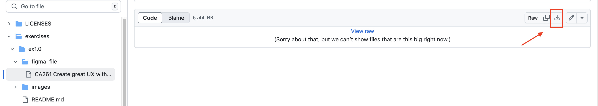
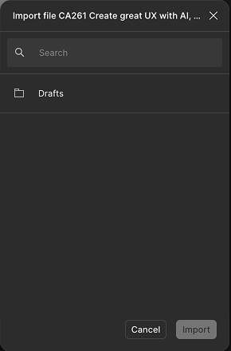
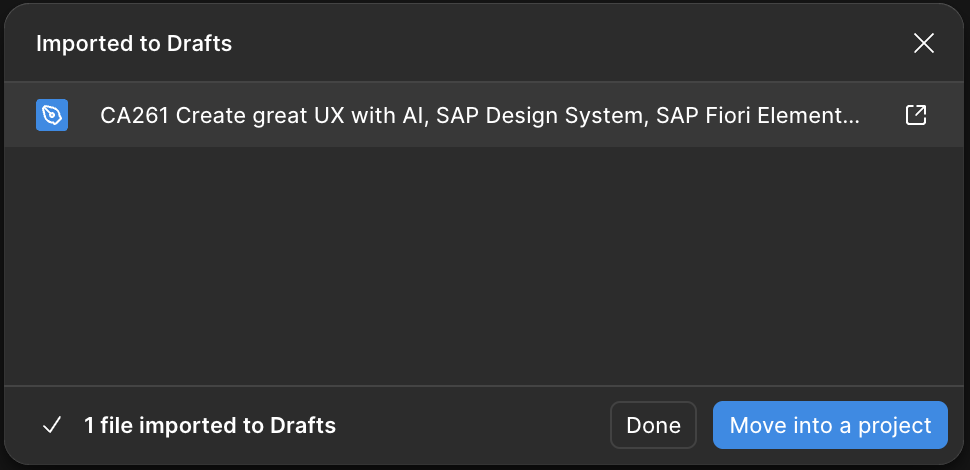
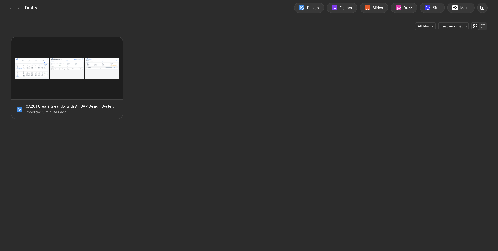
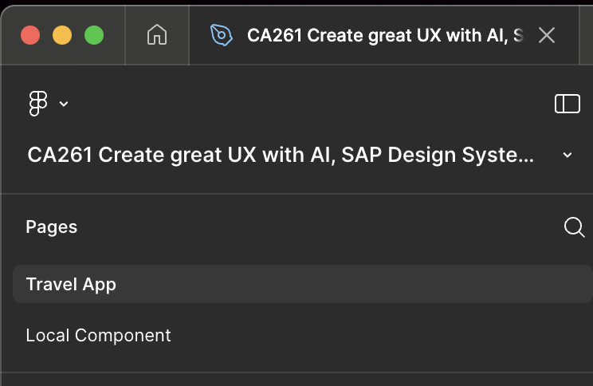
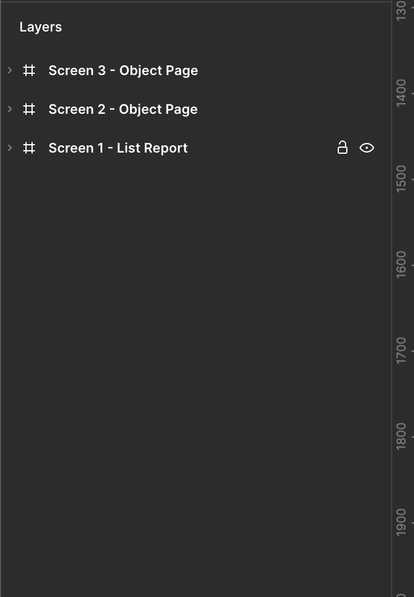
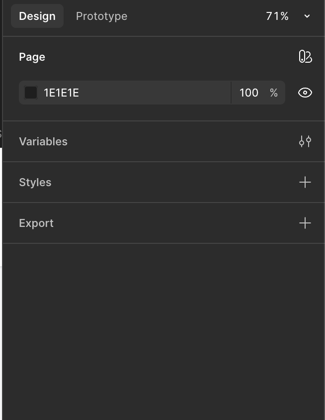

## Open the Figma client and login to it

1. Open Figma desktop, which will ask you to login with the browser, click on the link
2. Open the [Login File](../../Login/) and pick your assigned login data, enter the data in the browser window to complete your login to Figma
3. Click on **Open the desktop app** in the browser window, confirm the popup

## Execute the following steps to open your design

1. Download the [Figma file](./figma_file/CA261%20Create%20great%20UX%20with%20AI,%20SAP%20Design%20System,%20SAP%20Fiori%20Elements%20and%20SAP%20UI5.fig)  to your local machine.

   

2. Open the file in Figma
   * Double-click the downloaded file.
   * Choose "Figma" in case a popup ask for the app to start it with
   * The Figma client will launch
   * A popup will appear asking where to import the new file.
   * Choose your **_Drafts_** folder. 
   * Confirm the import

   

   * In the next dialog, click on **_Done_**.

   

   * Now, your **_Drafts_** should contain the imported file. Double click on it.

   

4. Explore the Figma interface
   * The design will open in a new tab within Figma.

   

   * On the left side panel, you’ll see the layer structure of the design.

   

   * On the right side panel, you’ll find settings and properties for each selected element in the main design area.

   

Continue to - [Exercise 1.1 - Adjust the buttons in the object page header](../ex1.1/README.md)
