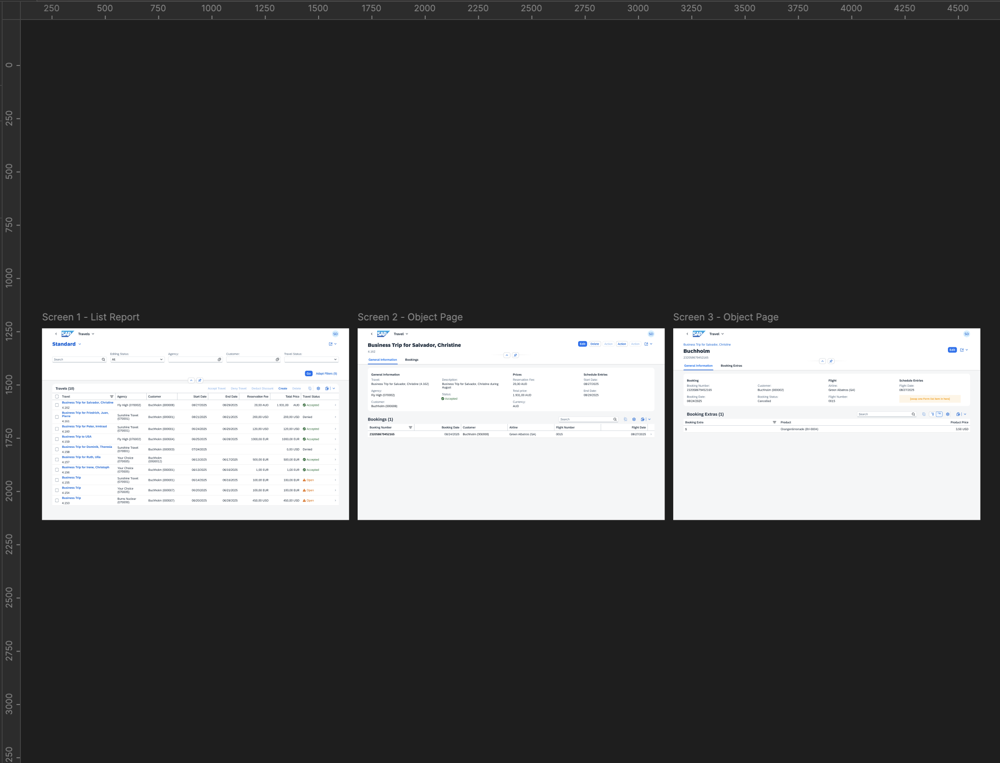
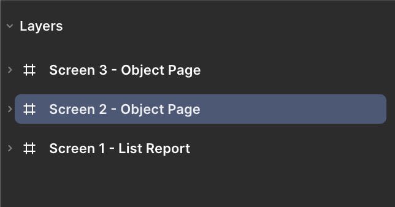
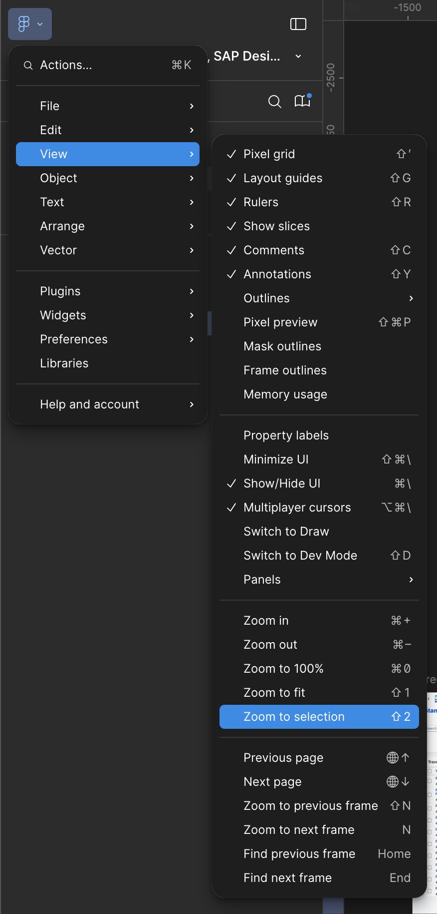
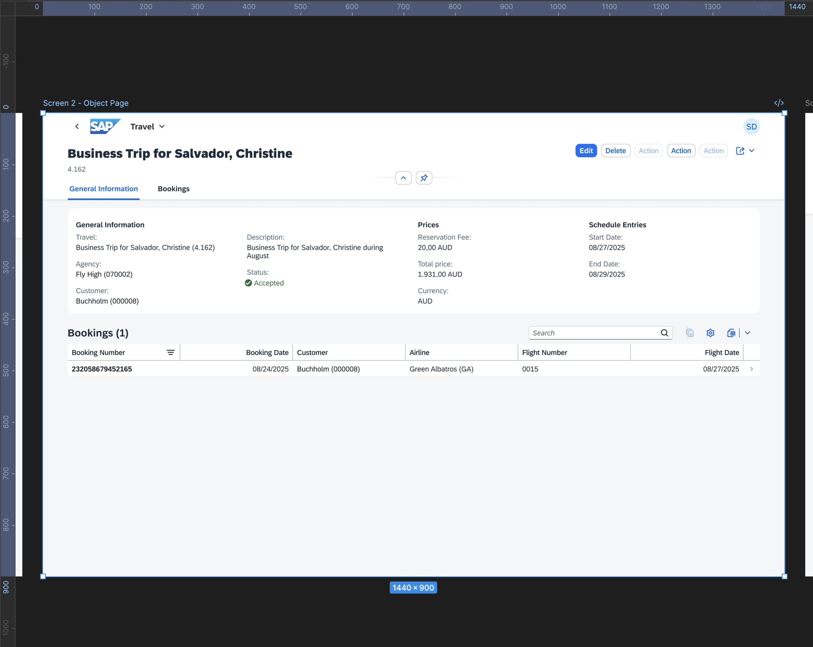
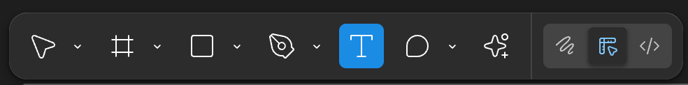
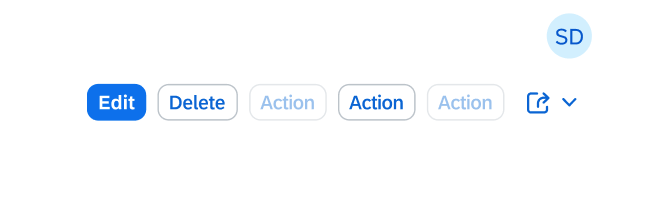

## Adjust the buttons in the object page header

**Check the following steps to adjust the buttons:**

1. **Explore the Canvas**  
Familiarize yourself with the canvas in the center of your screen. You’ll see three prepared frames—each representing a screen of the application.

2. **Navigate to Screen 2**   
* Select the **_Screen 2 - Object Page_** on the left side panel.

* From the main menu select **_View_** → **_Zoom to Selection_**.

* Your canvas now is focused on the second screen of your application.

3. **Activate the Text Tool**  
Press "T" on your keyboard to switch to the **_Text_** tool, or click the **_Text_** tool icon in the tool menu at the bottom of the screen.

4. **Edit Button Texts**  
Click into each button’s text field to modify the action labels.
   

Replace the current button text **_Action_** with the following:

* **_Accept Travel_**

* **_Deny Travel_**

* **_Deduct Discount_**

Congratulations! The action buttons now display the correct labels, and your object page header is updated accordingly.

Continue to - [Exercise 1.2 - Add a form item in the object page](../ex1.2/README.md)
