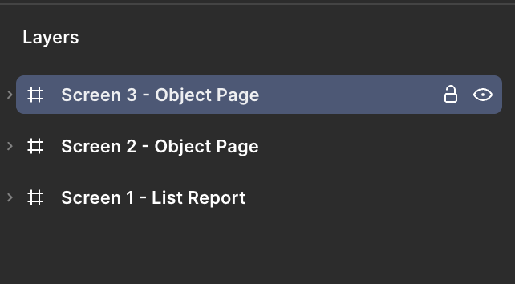
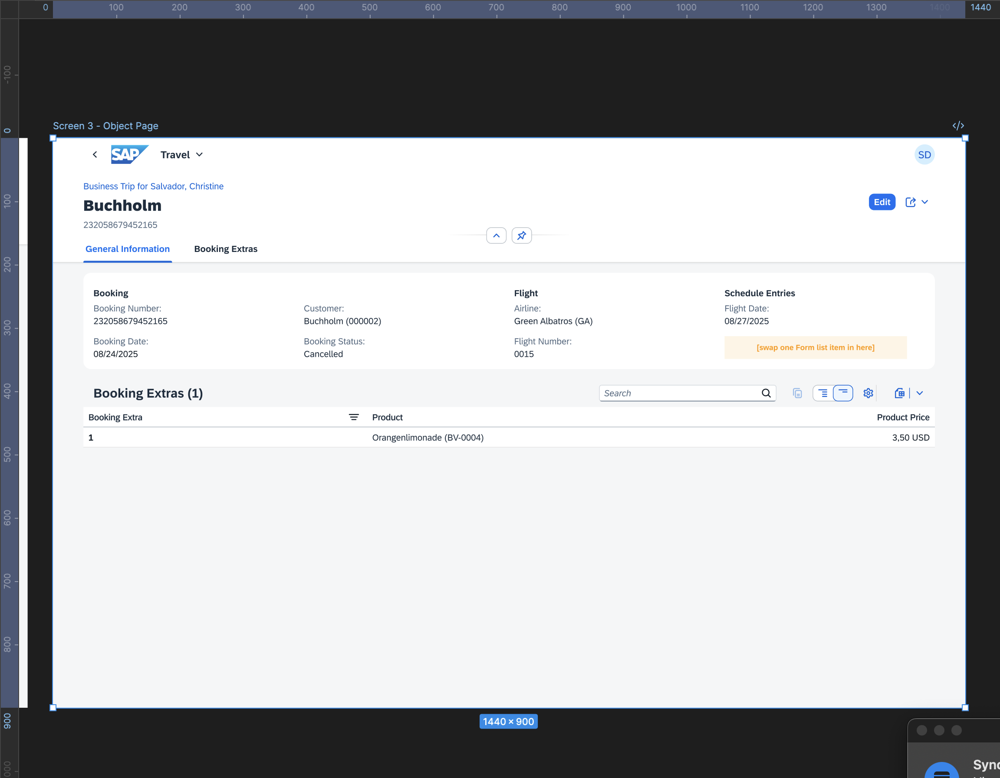
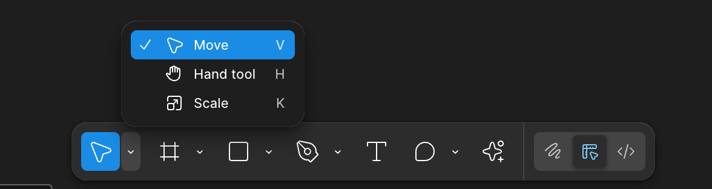
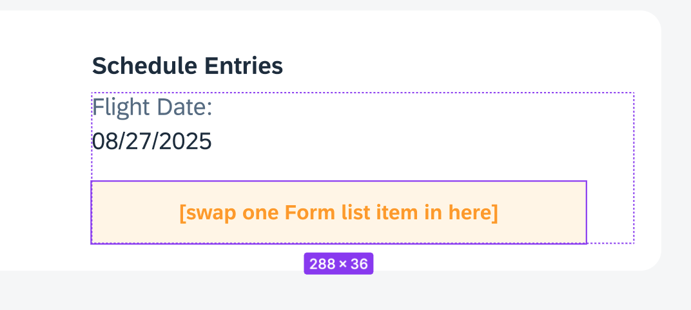
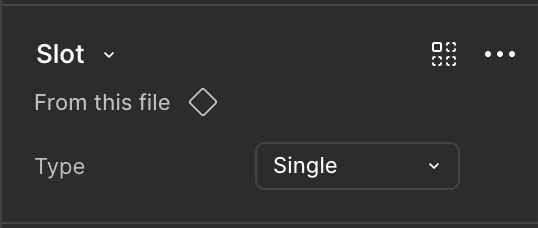
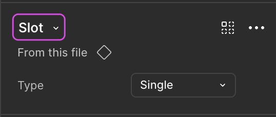

## Add a form item in the object page

**Check the following steps to edit your design:**  
You wish now to edit a particular form item on the third screen.

1. **Navigate to Screen 3**  
* Select the **_Screen 3 - Object Page_** from the left side panel.

* From the main menu select **_View_** → **_Zoom to Selection_**.

* Your canvas now is focused on the third screen of your application.

2. **Activate the Move Tool**  
Press _V_ on your keyboard to switch to the **_Move_** tool, or click the **_Move_** tool icon in the tool menu at the bottom of the screen.

3. **Select the Yellow Slot**   
Find the yellow slot labeled “[swap one Form list item in here]”. Hold _Ctrl_ and single-click the item to select it.

* The left side panel will display the expanded tree structure. Select **_Form Item 02_**

* The right side panel will show the properties of the selected yellow slot.

4. **Swap the Component**  
At the top of the right panel, you'll see the component name **_Slot_**.

* Click the dropdown to open the **__Swap Instance__** popup.

* In the search field, type _form item_.

* In the dropdown, select **_Created in this file_**.

* Review the results and choose the item that matches your search term.

Once selected, the slot will be replaced with the new component. You can immediately see the visual update on the frame.

Continue to - [Exercise 1.3 - Edit the new form item in the object page](../ex1.3/README.md)
