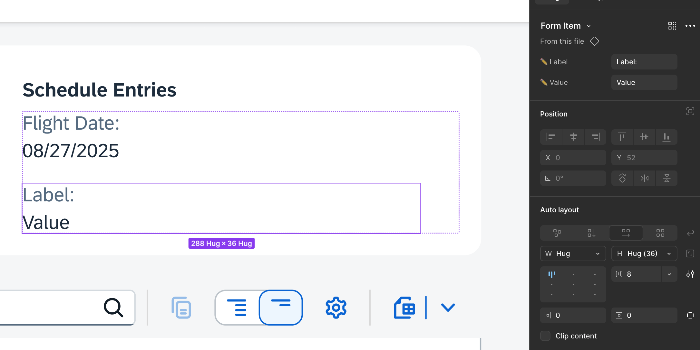
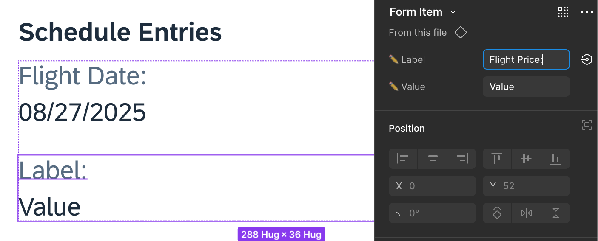
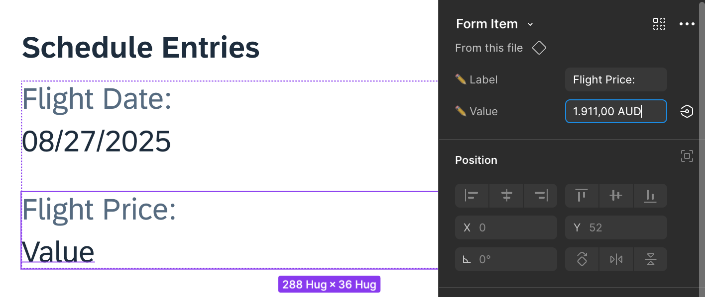

## Edit the new form item in the object page

**Check the following steps to adjust your design:**
1. **Select the New Component**.  
You’ve just swapped the **_Slot_** with a **_Form Item_**. The new component should now be highlighted on the canvas.
* If it isn’t, press _Ctrl_ and single-click the component to select it manually.

2. **View Component Properties**  
On the top of the right side panel, you’ll now see the properties of the **_Form Item_** component—specifically Label and Value.

3. **Edit the Label**   
Locate the **_Label_** field, which is marked with an edit icon. Click into the field and type **_Flight Price:_**

* Press _Tab_ on your keyboard to move out of the field and see the outcome.

4. **Edit the Value**   
Next, select the **_Value_** field, also marked with an edit icon. Click into the field and type **_1.911,00 AUD_**

* Press _Tab_ on your keyboard to move out of the field and see the outcome.

Congratulations! You’ve successfully adjusted your design.
The frame should now visually reflect the updated **_Form Item_** with the new label and value.

Continue to - [Exercise 1.4 - Export your designs](../ex1.4/README.md)
