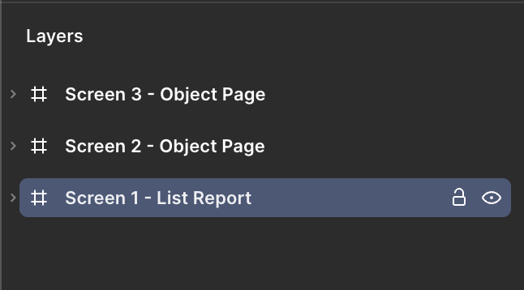
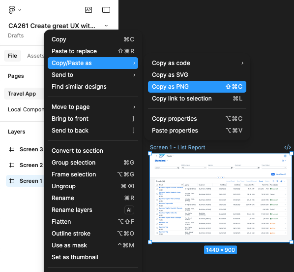

## Export your designs

**Check the following steps to export your frames:**  
   
Now you have to copy the links to each one of the frames. Let's take as example the List Report.

* Select the **_Screen 1 - List Report_** from the left side panel.

* Right click on it.

* A context menu will appear.

* Hover over **_Copy/Paste as_**

* Click on **_Copy as PNG_**.

The URL for the selected screen is now copied to your clipboard.

Continue to - [Exercise 1.5 - Enable your MCP Server in Figma](../ex1.5/README.md)
