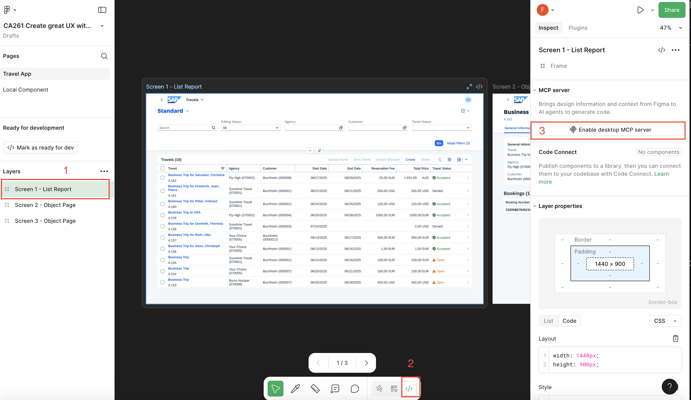
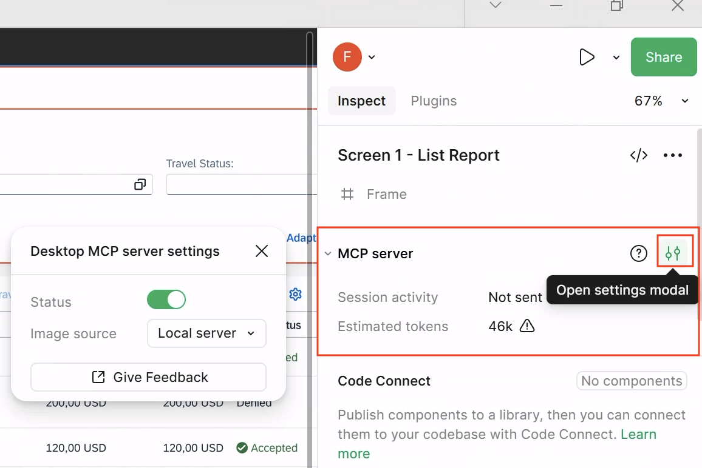
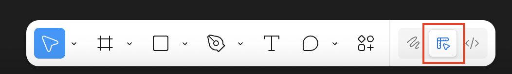

## Enable your MCP Server in Figma

**Follow these steps to activate the MCP server in your Figma Desktop application:**

1. **Activate Developer Mode and Enable MCP Server**
   - Toggle to `Dev Mode` in Figma Desktop
   - Click the `Enable desktop MCP server` option

   

   

3. **Return to Design View**
   - Switch back to `Design Mode` to continue working with your designs

   

* Keep Figma Desktop client running in the background.

Continue to - [Setup Visual Studio Code Development Environment](../ex1.6/README.md)