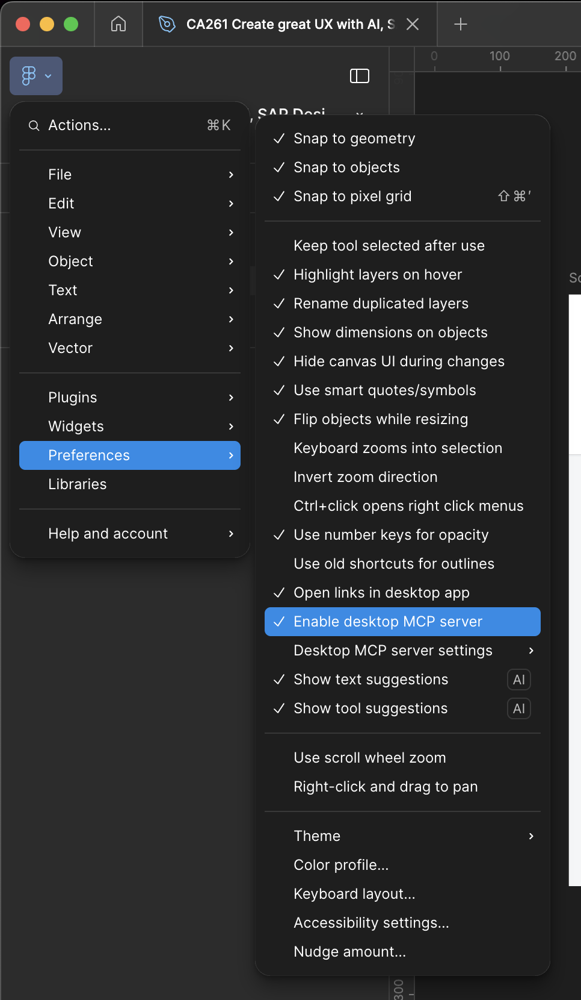

## Enable your MCP Server in Figma

**Check the following step to enable your MCP server in the Figma Desktop client:**

* From the menu bar, go to **_Figma_** → **_Preferences_** → **_Enable desktop MCP Server_**. Make sure it is checked.

* Keep Figma Desktop client running in the background.

Continue to - [Setup Visual Studio Code Development Environment](../ex1.6/README.md)