## Setup Visual Studio Code Development Environment

## Vs Code (Run as Administrator):
1. Click the **Start** menu and type `Visual Studio Code`.

2. Right-click on **Visual Studio Code** in the search results.

3. Select **Run as administrator** from the context menu.

   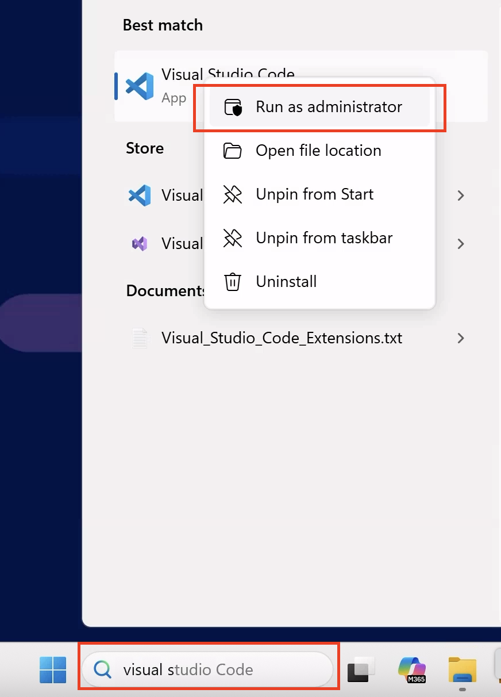

4. If prompted by User Account Control, click **Yes** to allow.

5. From the top menu, click on **File > Open Folder...**

6. In the dialog window, navigate to your **C:/** directory.

   - Create a new folder named `SAPDevelop`.
   - Inside `SAPDevelop`, create another folder called `TechedCA261` and select it.
   - Your folder structure should be: `C:/SAPDevelop/TechedCA261`

7. `TechedCA261` folder is now opened in VS Code Explorer.

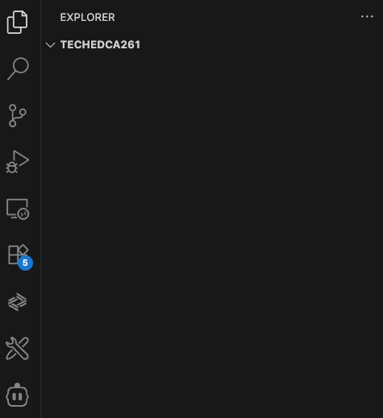

## Configure Cline

1. **Install Cline extension (version 3.37.1)**
   - Go to the top menu and select **Terminal > New Terminal**.

   Execute
   ```
      code --install-extension saoudrizwan.claude-dev@3.37.1
   ```

2. **Open the Cline Panel**

   - In VS Code, click the **Cline icon** from the left sidebar (Activity Bar).
   - The Cline welcome screen will appear.

   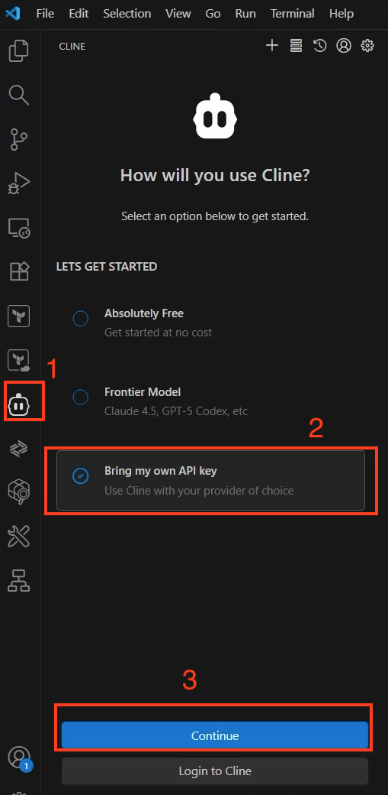

   - On the welcome screen, select **Bring my own API key** --> Continue.

   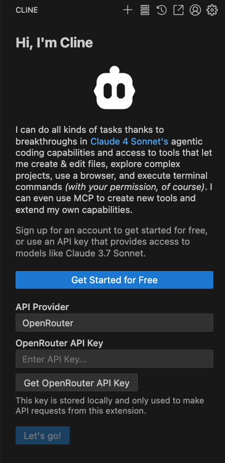

3. **Enter API Configuration**
   - Set **API Provider** to `SAP AI Core`.
   - Enter the following authentication details:
     - AI Core Client ID:
       ```
       (TBD)
       ```
     - AI Core Client Secret:
       ```
       (TBD)
       ```
     - AI Core Base URL:
       ```
       (TBD)
       ```
     - AI Core Auth URL:
       ```
       (TBD)
       ```
     - AI Core Resource Group:
       ```
       default
       ```

These credentials are stored locally and only used to make API requests from the extension.

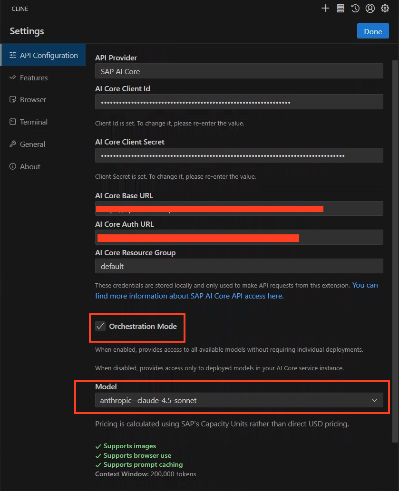

4. **Select AI Model**
   - Check Orchestration Mode.
   - select **Model** `anthropic-claude-4.5-sonnet`.

5. **Collapse Mcp responses**

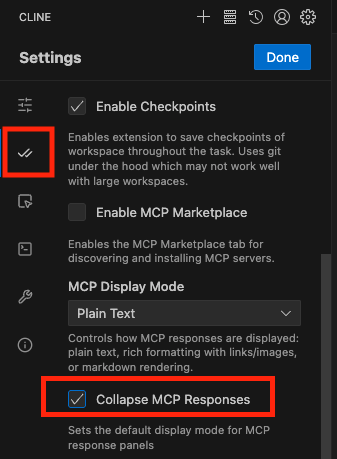

6. **Disable Browser Tool Usage**
   - In the **Cline Settings**, Click on the **Browser** section.
   - Check the option **Disable browser tool usage**.

     

7. **Configure Terminal settings on Cline**
   - In the **Cline Settings**, Click on the **Terminal** section.
   - Select **Git Bash** as your default terminal profile.
   - Click on `Done`

   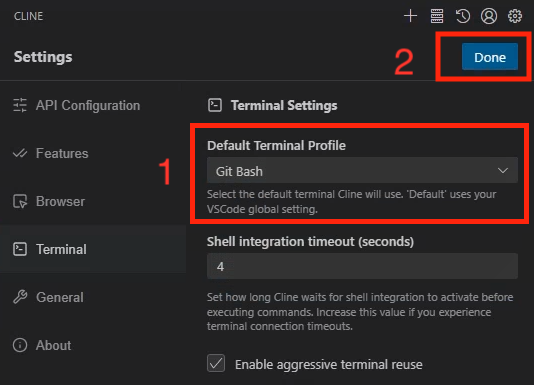
   
8. **Configure Terminal settings on Vscode**
   - Go to the top menu and select **Terminal > New Terminal**.
   - In the terminal panel, click the dropdown arrow next to the plus (+) icon.
   - Select **Select Default Profile** from the dropdown menu.
   - Choose **Git Bash** from the list of available terminal profiles.

   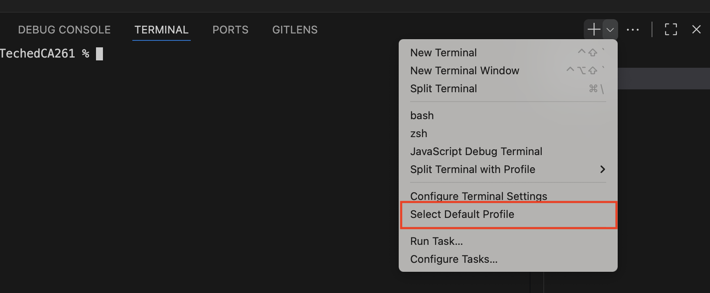

   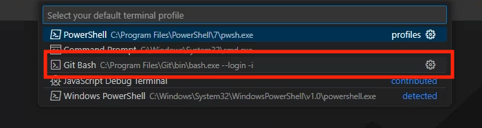

## Install and Configure MCP Servers

1. **Install MCP Servers and SAP Fiori Generator**
   - The terminal is already opened at the bottom of VS Code.
   - Install the **Fiori MCP Server**:

   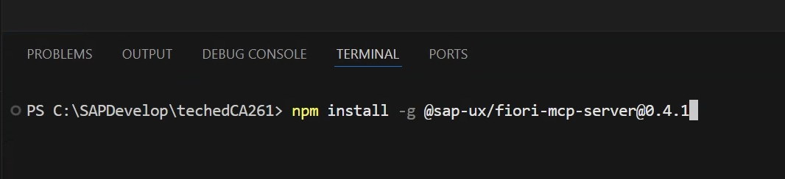

   Execute

   ```bash
   npm install -g @sap-ux/fiori-mcp-server@0.4.1
   ```

   - Install the **CAP MCP Server**:

   Execute

   ```bash
   npm install -g @cap-js/mcp-server@latest
   ```

   - Install the **SAP Fiori application generator**:

   Execute

   ```bash
   npm install -g @sap/generator-fiori@latest
   ```

   - Install the **SAP CAP CDS development toolkit**:

   Execute

   ```bash
   npm install -g @sap/cds-dk
   ```

2. **Open MCP Server Configuration in Cline**

   - In the Cline panel, Click the **MCP Servers** icon in the top-right corner.
   - Click on Configure.
   - Select **Configure MCP Servers**.  
     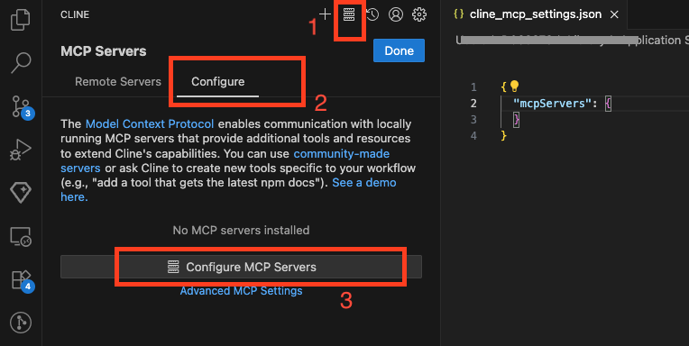

3. **Update `cline_mcp_settings.json`**
   - Configure MCP servers by editing your Cline MCP settings file (`cline_mcp_settings.json`):
   - Copy below content and Save file.
     ```json
     {
       "mcpServers": {
         "fiori-mcp": {
           "type": "stdio",
           "timeout": 600,
           "command": "cmd",
           "args": ["/c", "npx", "-y", "@sap-ux/fiori-mcp-server@0.4.1"]
         },
         "cds-mcp": {
           "command": "cmd",
           "args": ["/c", "npx", "-y", "@cap-js/mcp-server"],
           "env": {}
         },
         "Figma Dev Mode MCP": {
           "timeout": 300,
           "type": "streamableHttp",
           "url": "http://127.0.0.1:3845/mcp"
         }
       }
     }
     ```
     - close file `cline_mcp_settings.json`.

4. **Reload Vs code**

   - On Vscode, go to menu bar and click **View → Command Palette…**
   - Type `Reload Window` and select `Developer: Reload Window`.

   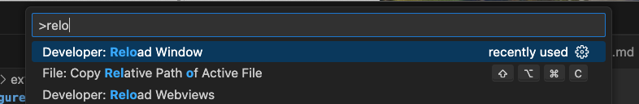

5. Verify MCP servers are installed and enabled.

   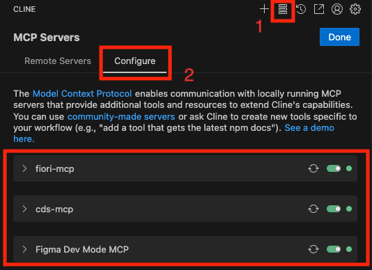

6. Enable Auto-Approval for MCP Tools
   - Expand each MCP server (fiori-mcp, cds-mcp, and figma-mcp)
   - Check the `Auto approve all tools` option for each server
   - This will allow automatic execution without manual confirmation

   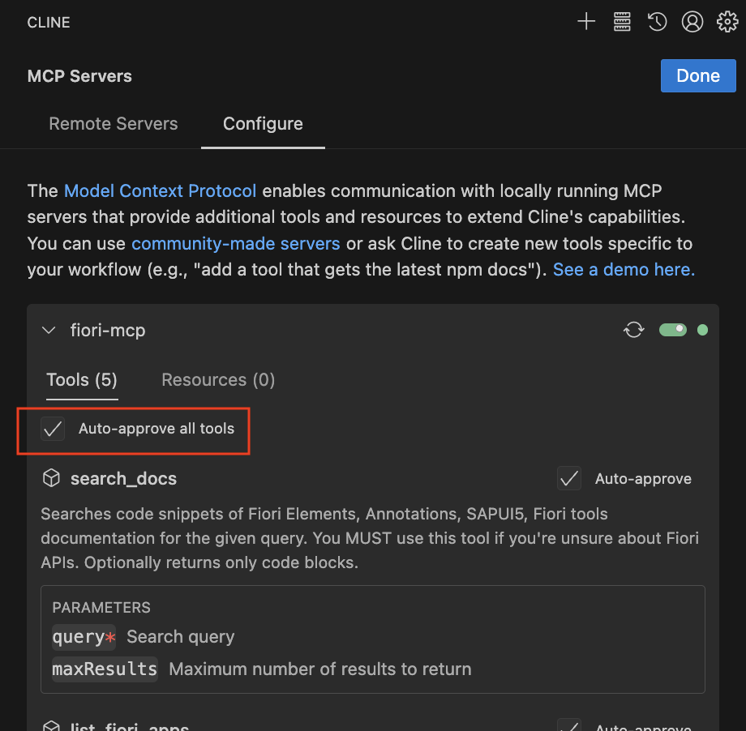

6. Click on Done

> [!NOTE]
> Dismiss any notification popups from Cline and VS Code to ensure a clean workspace. This includes extension recommendations, update notifications, and setup prompts.

   for example:

   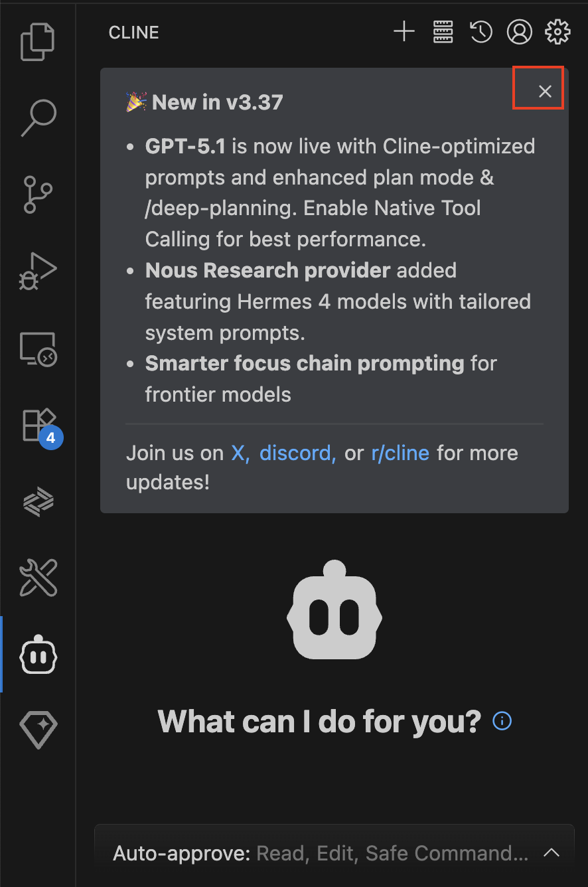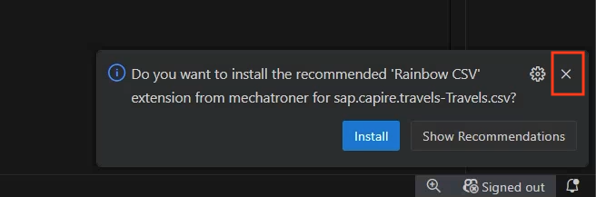

## Configure Rules for MCP Servers

1. Click the `Manage cline rules and workflows` button.

   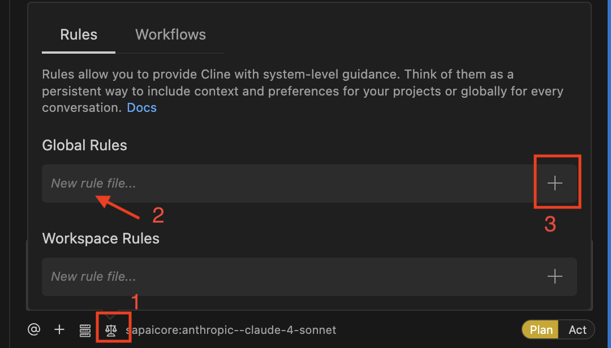

2. To add a global rule, enter a rule name `fioriRules` and click the + icon as shown in screenshot above.
3. File `fioriRules.md` is opened in the editor panel.
4. Copy and paste following rules.

```
## Rules for creation or modification of SAP Fiori elements apps

- When asked to create an SAP Fiori elements app check whether the user input can be interpreted as an application organized into one or more pages containing table data or forms, these can be translated into a SAP Fiori elements application, else ask the user for suitable input.
- The application typically starts with a List Report page showing the data of the base entity of the application in a table. Details of a specific table row are shown in the ObjectPage. This first Object Page is therefore based on the base entity of the application.
- An Object Page can contain one or more table sections based on to-many associations of its entity type. The details of a table section row can be shown in an another Object Page based on the associations target entity.
- The data model must be suitable for usage in a SAP Fiori elements frontend application. So there must be one main entity and one or more navigation properties to related entities.
- Each property of an entity must have a proper datatype.
- For all entities in the data model provide primary keys of type UUID (technical key) and ID (business key) fields.
- When creating sample data in CSV files, all primary keys and foreign keys MUST be in UUID format (e.g., `550e8400-e29b-41d4-a716-446655440001`).
- When generating or modifying the SAP Fiori elements application on top of the CAP service use the Fiori MCP server if available.
- When attempting to modify the SAP Fiori elements application like adding columns you must not use the screen personalization but instead modify the code of the project, before this first check whether an MCP server provides a suitable function.
- When previewing the SAP Fiori elements application use the most specific `npm run watch-*` script for the app in the `package.json`. If `npm run watch-*` script is already opened/running in a terminal, do not start another terminal window.
- MUST NOT use `npm start`, `npm run start`, `cds serve`, `cds-serve`, `sleep`.
- Must not open http://localhost:4004/ after lauching preview
- After launching the application stop and wait for user commands
```

5. Save file `fioriRules.md`.
6. Add another global rule `cdsRules` and click the + icon.
7. File `cdsRules.md` is opened in editor panel.
8. Copy and paste following rules.

```
- You MUST search for CDS definitions, like entities, fields and services (which include HTTP endpoints) with cds-mcp, only if it fails you MAY read \*.cds files in the project.
- You MUST search for CAP docs with cds-mcp EVERY TIME you create, modify CDS models or when using APIs or the `cds` CLI from CAP. Do NOT propose, suggest or make any changes without first checking it.
- When creating new CAP project ask cds mcp server. while using cds init, do not include any --add options (e.g., --add hana, --add sqlite, --add tiny-sample, etc.). Only use the plain form: cds init
- You MUST NOT use EDM JSON syntax for CDS.
```

9. Save file `cdsRules.md`.
10. Add another global rule `figmaRules` and click the + icon.
11. File `figmaRules.md` is opened in editor panel.
12. Copy and paste following rule 
```
## Rules for Figma MCP Server

- You MUST ALWAYS use the Figma MCP server when working with Figma files or designs
- You MUST ONLY use the `get_screenshot` tool from the Figma MCP server
- You MUST NOT use the `get_design_context` tool under ANY circumstances
- You are STRICTLY FORBIDDEN from using any other Figma MCP tools
```

13. Save all the `.md` files and make sure the rules are enabled as shown below.

   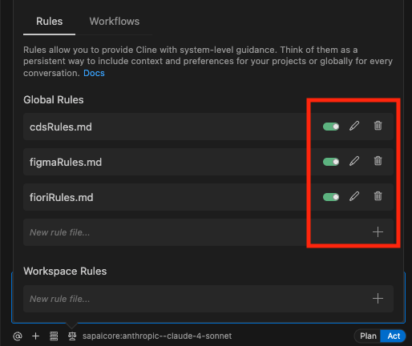

Continue to - [Exercise 2 - Generate CAP Project and Fiori List Report App from Figma Design](../ex2.0/README.md)
