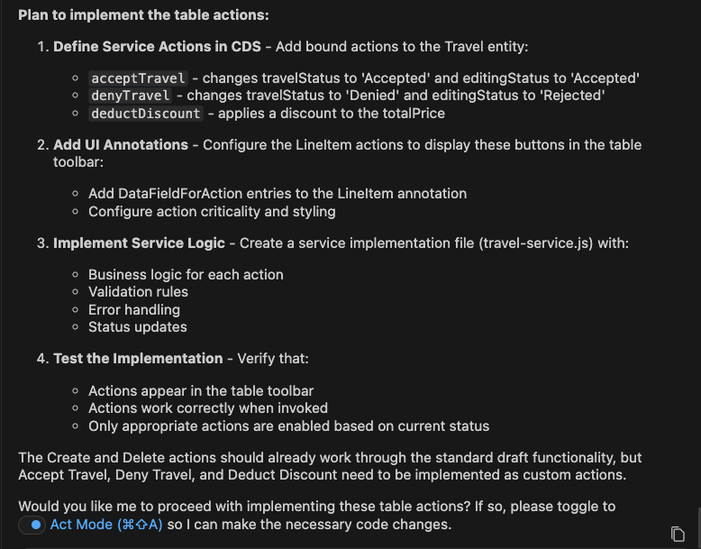
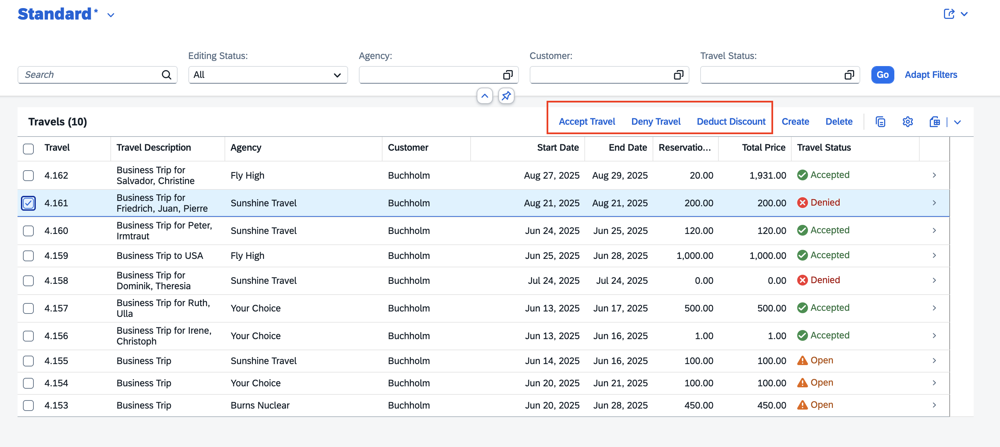

## Add actions from design to list report table toolbar

1. Close the previous task.
2. Start new task. Select **Plan Mode**.
3. Copy and paste the following prompt into the task input:  
   ```
   Add actions from figma design to list report page. Use fiori mcp
   ```
4. Press `Enter` to execute the task.
5. Cline prepares an **Implementation Plan**.
6. Once the implementation plan is ready, review it.

> [!Note]
> The implementation plan generated by Cline may differ from the example shown below.



7. Switch to **Act mode**.

8. Cline executes the implementation plan.

9. When the task is complete. Verify actions (Accept Travel, Deny Travel, Deduct Discount) appear on the list report toolbar.



## Troubleshoot

- If actions appear as inline actions on each row of the list report table, execute the prompt: `actions should appear on list report toolbar`

Continue to - [Exercise 2.3 - Apply business logic for action accept travel](../ex2.3/README.md)


