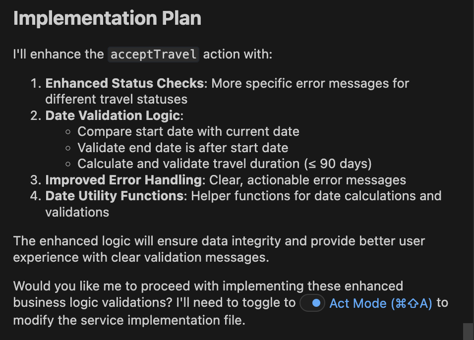
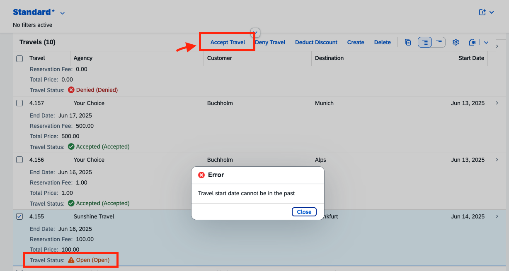

## Apply business logic for action accept travel

1. Close the previous task.
2. Start new task. Select **Plan Mode**.
3. Copy and paste the following prompt into the task input:  
   ```
   Apply business logic to action accept travel. 
   Dates must be validated so that start dates are not in the past.
   use cap mcp
   ```
4. Press `Enter` to execute the task.
5. Cline prepares an **Implementation Plan**.
6. Once the implementation plan is ready, review it.

> [!Note]
> The implementation plan generated by Cline may differ from the example shown below.



7. Switch to **Act mode**.

8. Cline executes the implementation plan.

9. When the task is complete. In the application preview, select travel record with travel status `open`. click on action `Accept Travel` to verify error message

> [!Note]
> Error message text might differ from screenshot



## TroubleShoot

1. Make sure Cds mcp server is connected. Close and retry task.

2. If clicking the `Accept Travel` action does not work. Enter prompt `Retry. Clicking on action button does not result in batch call.`

3. Hard reload Browser: Open Developer Tools (`F12`), long press(2-3 sec) browser refresh button, select "Empty Cache and Hard Reload"

Continue to - [Exercise 2.4 - Configure filter travel status as valuehelp and display it as dropdown](../ex2.4/README.md)