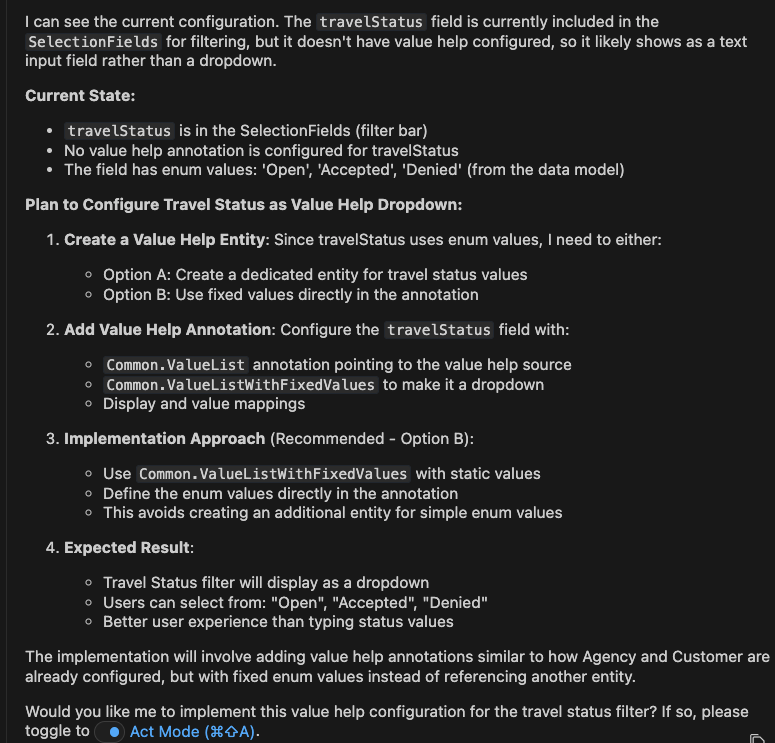
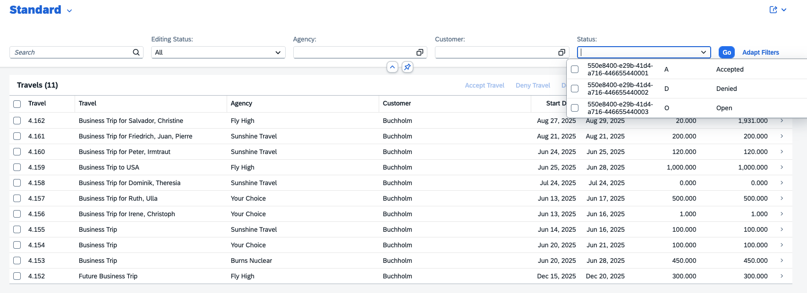

## Configure filter travel status as valuehelp and display it as dropdown

1. Close previous task and start new task in **Plan Mode**
2. Copy and paste the following prompt into the task input:  
   ```
   Configure filter "travel status" as valuehelp and display it as dropdown showing status code and description.
   Use fiori mcp.
   ```
3. Press `Enter` to execute the task.
4. Cline prepares an **Implementation Plan**.
5. Once the implementation plan is ready, review it.

> [!Note]
> The implementation plan generated by Cline may differ from the example shown below.



6. Switch to **Act mode**.

7. Cline executes the implementation plan.

8. When the task is complete. Verify travel status filter appears as dropdown in application preview.



## Troubleshoot

- Does not appear as dropdown. execute prompt `travel status filter is not a dropdown`

- If travel status dropdown contains UUID. You can remove it by executing prompt
  `Configure UUID/GUID as External ID in travel status dropdown. use fiori mcp`.
   When the task is complete. Verify  Common.ExternalID annotation is applied on travel status to hide UUID.

For example:
```
annotate service.Travels with {
    to_Status @(
        Common.ExternalID : to_Status.Name
    )
};
```

Continue to - [Exercise 2.5 - Apply criticality to travel status column](../ex2.5/README.md)

