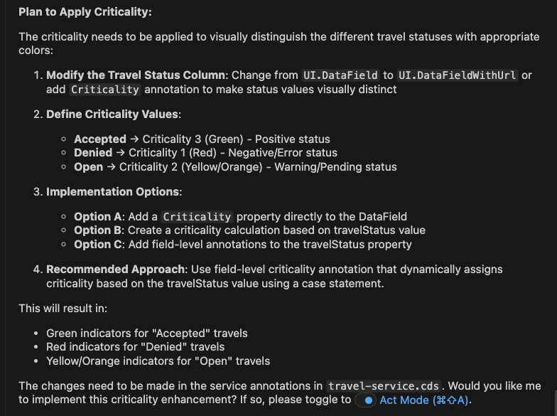
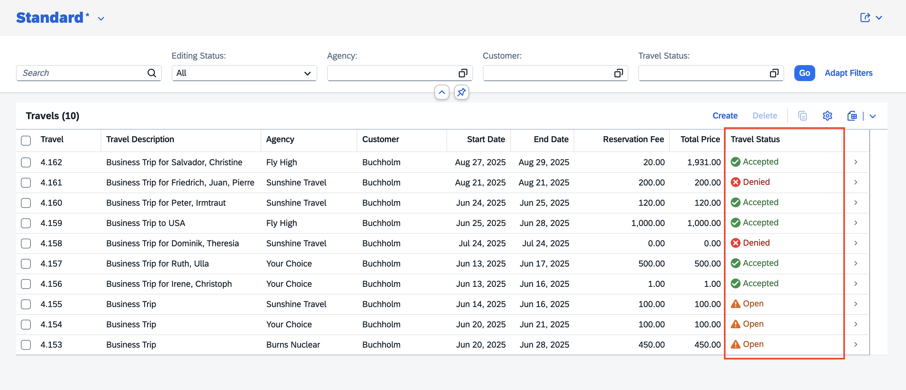

## Apply criticality to travel status column

> [!NOTE]
> If the criticality is already applied to travel status column.
Continue to next excercise.
----

1. Close previous task and start new task in **Plan Mode**.
2. Copy and paste the following prompt into the task input:  
   ```
   Apply dynamic criticality to travel status column and make it visible in smaller screens.
   ```
3. Press `Enter` to execute the task.
4. Cline prepares an **Implementation Plan**.
5. Once the implementation plan is ready, review it.

> [!Note]
> The implementation plan generated by Cline may differ from the example shown below.



6. Switch to **Act mode**.

7. Cline executes the implementation plan.

8. When the task is complete. Verify criticality is applied on travel status column.



Continue to - [Exercise 3 - Modify travel object page based on figma design](../ex3.0/README.md)
