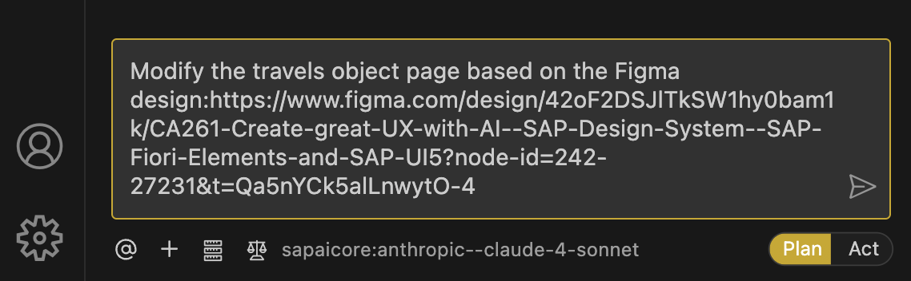

## Modify Travel Object Page Based on Figma Design

1. In the Cline panel, **_close the previous task_** and start a new one. Select **Plan Mode**.
2. Open Figma, right-click on "Screen 2 - Object Page" -> Copy/Paste as -> Copy as PNG
3. Enter the following prompt in the task input:  
   ```
   Modify the travels object page based on the Figma design.
   The object page should include a bookings table section.
   Add mock data for the bookings table.
   <Copy and Paste Figma screenshot(png) for Screen 2 - Object Page here>
   ```

   > [!NOTE]
   > Refer to [ex 1.4 Export your designs](../ex1.4/README.md#export-your-designs) to copy Figma PNG for `Screen 2 - Object Page`.

   

4. Press `Enter` to start the task.
5. Cline will generate an **Implementation Plan**.
6. Review the plan once it's ready. 
   - Review the header area/section should contain both title and description.
   - Make sure fields in sections are arranged to correct section and subsections.
   - Ensure the structure is one main General Information section with multiple subsections, not three separate sections.
     Enter prompt `prices and schedule entries are sub sections` to revise the plan.
   - If plan mentions header has general information and not in sections. Enter prompt `Header area does not contain general information` to revise plan.

> [!Note]
> The implementation plan generated by Cline may differ from the example shown below.


6. Switch to **Act mode**.

7. Cline will execute the implementation plan.

8. After completion, verify the object page in the application preview.


9. If the object page is not matching with the figma design, continue with following excercises to add one by one.

## Troubleshoot

If the object page looks different and does not match figma, execute prompt 
```
Match figma design with object page
```

Continue to - [Exercise 3.1 - Adjust Object Page Title and Description based on design](../ex3.1/README.md)
