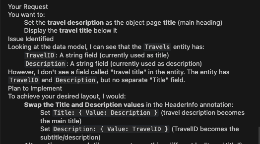
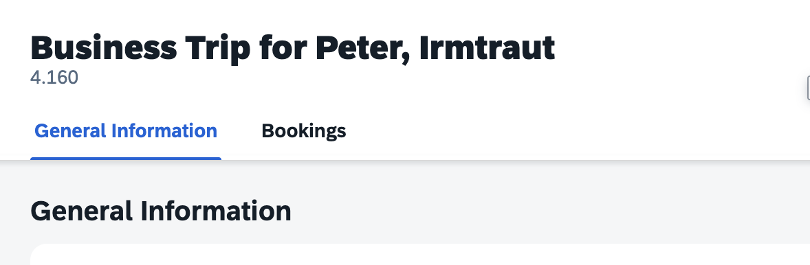

## Adjust Object Page Title and Description based on design

> [!NOTE]
> Object page already has title and description as per Figma, continue to next exercise.

1. In the Cline panel, select **Plan Mode**.
2. Enter the following prompt in the task input:  
   ```
   Set travel description as the object page title and display travel title below.
   ```
3. Press `Enter` to start the task.
4. Cline will generate an **Implementation Plan**.
5. Review the plan once it's ready.

**Disclaimer:**  
The implementation plan created by Cline may differ from the example shown below.



6. Switch to **Act mode**.

7. Cline will execute the implementation plan.

8. After completion, verify the object page in the application preview.

    

Continue to - [Exercise 3.2 - Set Label for Object page sub sections](../ex3.2/README.md)
