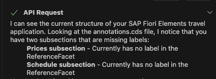
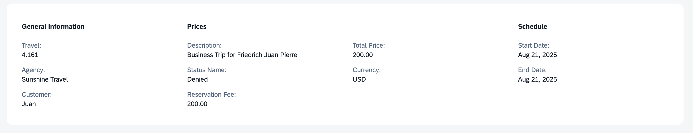

## Set Label for Object Page Subsections

> [!NOTE]
> Object page already has sub-section labels as per Figma, continue to next exercise.

1. In the Cline panel, select **Plan Mode**.
2. Enter the following prompt in the task input:  
   ```
   Add label for subsection "prices" and "schedule entries" based on figma design
   ```
3. Press `Enter` to start the task.
4. Cline will generate an **Implementation Plan**.
5. Review the plan once it's ready.
   - make sure there is only one general information section and subsections are placed inside it.
   - if you notice separate sections for price and schedule entries. 
   - Revise plan - Enter prompt `Move section price and schedule entries inside general information section as subsection and revise plan`.

> [!Note]
> The implementation plan generated by Cline may differ from the example shown below.



6. Switch to **Act mode**.

7. Cline will execute the implementation plan.

8. After completion, check the object page in the application preview.



Continue to - [Exercise 3.3 - Rearrange fields in General information section as per design](../ex3.3/README.md)
