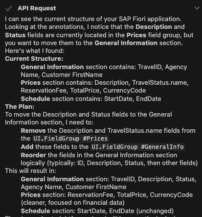
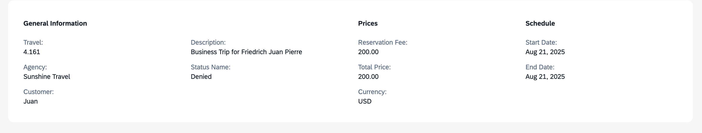

## Rearrange Fields in General Information Section as per Design

> [!NOTE]
> Object page already has fields arranged as per Figma, continue to the next exercise.

1. In the Cline panel, select **Plan Mode**.
2. Enter the following prompt in the task input:  
   ```
   Move description and status fields to the general information section as per design
   ```
3. Press `Enter` to start the task.
4. Cline will generate an **Implementation Plan**.
5. Review the plan once it's ready.

> [!Note]
> The implementation plan generated by Cline may differ from the example shown below.



6. Switch to **Act mode**.

7. Cline will execute the implementation plan.

8. After completion, verify the object page in the application preview.



Continue to - [Exercise 3.4 - Set Criticality for status field](../ex3.4/README.md)
