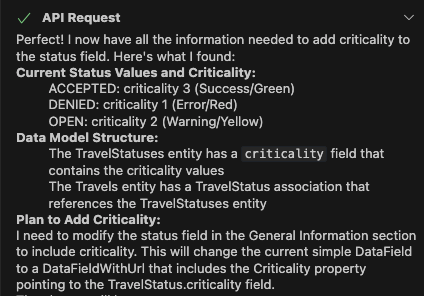
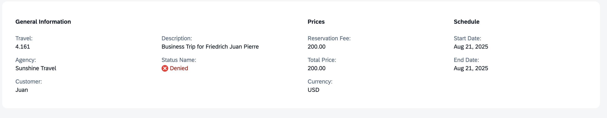

## Set Criticality for Status Field

1. In the Cline panel, select **Plan Mode**.
2. Enter the following prompt in the task input:  
   ```
   Apply criticality to the "Status" field in the general information section
   ```
3. Press `Enter` to start the task.
4. Cline will generate an **Implementation Plan**.
5. Review the plan once it's ready.

> [!Note]
> The implementation plan generated by Cline may differ from the example shown below.



6. Switch to **Act mode**.

7. Cline will execute the implementation plan.

8. After completion, verify criticality is applied to the travel status field.



Continue to - [Exercise 3.5 - Add Custom Section with RichTextEditor Building Block](../ex3.5/README.md)
